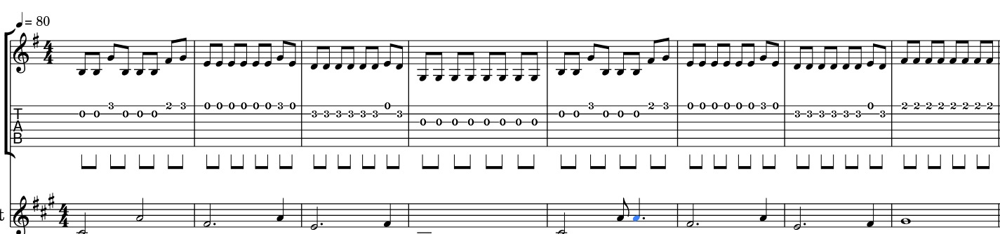

<!--
theme: gaia
class:
 - invert
headingDivider: 2 
paginate: true
-->

<!--
_class:
 - lead
 - invert
-->

# Jak sledovat harmonie na kytare

Autor: [Sergei Petrosian](mailto:spetrosi@redhat.com)

## Klavesnice Piana

## Jak Najit Znaky Stupnic na Klavesech

## Hmatnik Kytary a Basy

## Vzor durove a molove stupnice

Kazda ***Durova (Major)*** stupnice se sklada s nasledujiciho vzoru:

**Ton - Ton - Semiton - Ton - Ton - Ton - Semiton**

Kazda ***Molova (Minor)*** stupnice se sklada s nasledujiciho vzoru:

**Ton - Semiton - Ton - Ton - Semiton - Ton - Ton**

## <!--fit--> Vzor durove a molove stupnice na hmatnice basy

***Molova (Minor)  stupnice***

***Durova (Major)  stupnice***

## Rytm

## Nota s teckou

## Priklad na HH Post-punku

## Intervaly

## Root note

Nota ktera v dane melodie zni jako dom, jako misto kam cheme se vratit. Casto je posledni note v melodie, ale ne vzdicky. Od root noty pocitame vzoru stupnic.

## Root note pisnicek HH

Melodie Nights of the Long Knives je:

***B---A---G-F#-G-F#-E-E-E-E-E-E-E-E***

Melodie Experimentu:

***C-D#----C-F-------C-D#---C-B-G----***
***G-G--F----F-F-E----E-E-D----B-C---***

*Jaka jsou root note?*

Vsichni noty toniny root noty musi slusit te melodii

## Serie akordu

Ve stejne tonine muze byt vice akordu ktere muzou hrat od vice stupni

Treba: ***Em - Am - Bm - Em***

V hudbe to bude znamenat ze hrajeme ty stejne noty co v root tonine, ale zaciname od ruznych not

Vzdicky se ale vratime v root toninu

# 🎉
<!--
_class:
 - lead
 - invert
-->
### Q&A
Slajdy: https://spetrosi.github.io/jak_sledovat_harmonie_na_kytare/
Zdroj slajdu: https://github.com/spetrosi/jak_sledovat_harmonie_na_kytare
